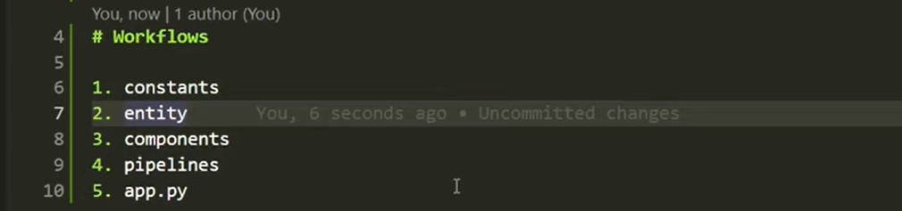

# End-to-end-Cell-Segmentation-Using-Yolo-v8

## Project Workflow 

Step 1: Define constants --> cellSegmentation/constant/training_pipeline/__init__.py
	ARTIFACTS_DIR: str = "artifacts"

	DATA_INGESTION_DIR_NAME: str = "data_ingestion"
	DATA_INGESTION_FEATURE_STORE_DIR: str = "feature_store"
	DATA_DOWNLOAD_URL: str = "https://drive.google.com/file/d/1dkVY_2Bc9JXSSfKBClR9ad-jnd9ZpDWm/view?usp=sharing"

Step 2: Define Config Entity (DataIngestionConfig class containing data_ingestion_dir, feature_store_file_path, data_download_url)
Step 3: Define Artifacts Entity (DataIngestionArtifact class)
		@dataclass
		class DataIngestionArtifact:
		    data_zip_file_path: str
		    feature_store_path: str
Step 4: Define Components: (data_ingestion, data_validation, model_trainer etc.. )
		Returns (DataIngestionArtifact --> zip_file_path, feature_store_path)
		Class DataIngestion
		Functions: download_data, extract_zip_file, initiate_data_ingestion
Step 5: Define Pipeline
		Class TrainingPipeline
		Functions start_data_ingestion, run_pipeline
Step 6: Define App.py
		Calls Training Pipeline run_pipeline

